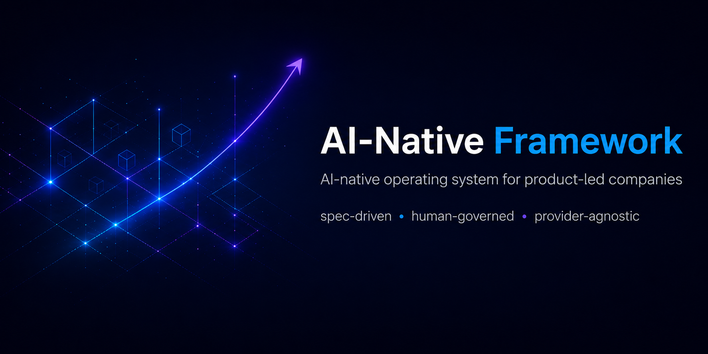

# AI-Native Framework



**An AI-native operating system for building and running product-led companies.**
*spec-driven · human-governed · provider-agnostic*

## What it is

An exploration project asking a single question: **what happens when a company runs every function — not just engineering — as governed agentic work?**

Most "AI for X" today is bolt-on automation: a chatbot here, a copilot there, a draft generator somewhere else. This repository takes a different bet. It treats AI as the substrate the company runs on, and codifies the operating loop end-to-end: `intent → discovery → product → build & ship → go-to-market → operations → feedback & learning`.

The framework is designed so agents can execute structured work under explicit constraints, while humans retain authority for strategy, ambiguity, and high-stakes decisions. The target is high leverage, not fake autonomy — a 90/10 automation-to-human ratio that only holds when judgment checkpoints, confidence thresholds, and escalation rules are explicit.

## Why it exists

I'm building this as an open exploration of how product-led companies can use governed agentic work to turn AI into a *repeatable source of product value and growth* — not a series of one-off experiments. The repository is both the artifact and the experiment: spec-driven artifacts, event-observable runtime, provider-agnostic interfaces, and human governance baked into the authority ladder rather than left to chat.

## Who this is for

- **Developers and AI builders** — start at [AGENTS.md](AGENTS.md), then [Quick Start](#quick-start). The interesting source of truth lives in [spec/](spec/), [interfaces/](interfaces/), and [ai/playbooks/](ai/playbooks/). Each playbook is a reusable, agent-executable procedure.
- **Recruiters and hiring partners** — this project demonstrates spec-first product thinking, governed agentic systems design, and end-to-end ownership across product, engineering, and operations. The full narrative behind it lives in [docs/AI_NATIVE_FRAMEWORK.md](docs/AI_NATIVE_FRAMEWORK.md); a working application built on it lives in [products/](products/).
- **Executives and product leaders** — read the [Operating Model](#operating-model) and [End-To-End Scope](#end-to-end-scope) sections below for the short version, and [docs/AI_NATIVE_FRAMEWORK.md](docs/AI_NATIVE_FRAMEWORK.md) for the full framework prose. The question this answers: *what changes structurally when AI moves from feature to substrate?*

## How it works

The framework is built as four layers an agent or a person can read top-to-bottom. Each layer constrains the one above it, so the system stays consistent even as agents do the work.

**1. Specs are the source of truth.** A product is described in a YAML spec under [spec/examples/](spec/examples/) (e.g. [dashboard-product.yaml](spec/examples/dashboard-product.yaml)), validated by [spec/schema/product-spec.schema.json](spec/schema/product-spec.schema.json). The spec declares the product's slices, events, and policies. No feature exists until it exists in the spec. `npm run validate` enforces this on every change.

**2. Interfaces describe capabilities, not vendors.** [interfaces/interfaces.yaml](interfaces/interfaces.yaml) defines the logical operations any implementation has to provide — `read_spec`, `validate_spec`, `emit_event`, and so on. Anything that needs to talk to the framework (a model, an IDE, an MCP adapter, a CI job) goes through these contracts, which is how the system stays provider-agnostic. The current MCP adapter projection lives in [docs/AGENT_INTEGRATION.md](docs/AGENT_INTEGRATION.md).

**3. The agent surface tells agents what to do.** [AGENTS.md](AGENTS.md) is the first file any agent reads. From there it routes through three indexes under [ai/](ai/):
- [ai/SKILLS.md](ai/SKILLS.md) — *roles* an agent can take on (Developer, PM, Designer, Quality Engineer, Framework Keeper). Each skill body lives in [ai/skills/](ai/skills/).
- [ai/PLAYBOOKS.md](ai/PLAYBOOKS.md) — *procedures* for recurring operational work. Each body lives in [ai/playbooks/](ai/playbooks/).
- [ai/MEMORY.md](ai/MEMORY.md) — durable repo facts, decisions, and open loops, so agents don't relearn the same things every run.

**4. Playbooks turn repeated work into reusable procedures.** The interesting ones to look at: [feature-implementation.md](ai/playbooks/feature-implementation.md) (spec → events → code → PR), [pull-request-execution-loop.md](ai/playbooks/pull-request-execution-loop.md) (residual risk, freshness, merge), [publish-to-production.md](ai/playbooks/publish-to-production.md), and [resolve-sentry-issues.md](ai/playbooks/resolve-sentry-issues.md) (incident → evidence → closure). A playbook is short, self-contained, and executable by an agent without further context.

### A working example: the dashboard

[products/dashboard/](products/dashboard/) is a real Next.js + Supabase + Sentry + PostHog application built *on* the framework, not alongside it. It's how every layer above gets exercised end-to-end:

1. A feature starts as a change to [spec/examples/dashboard-product.yaml](spec/examples/dashboard-product.yaml) — new slice, new events, new acceptance criteria.
2. `npm run validate` confirms the spec is structurally and semantically legal.
3. An agent picks up the [feature-implementation playbook](ai/playbooks/feature-implementation.md), implements the slice, and emits the declared events from the runtime.
4. Sentry + PostHog capture errors and analytics per [docs/ANALYTICS_STANDARD.md](docs/ANALYTICS_STANDARD.md); tests run per [docs/QUALITY_STANDARD.md](docs/QUALITY_STANDARD.md).
5. The PR moves through [pull-request-execution-loop.md](ai/playbooks/pull-request-execution-loop.md): risk classified, checks verified, low-risk merges executed by the agent, high-risk decisions escalated to a human.
6. [publish-to-production.md](ai/playbooks/publish-to-production.md) promotes `staging` → `main`, [release-management.md](ai/playbooks/release-management.md) cuts the tag.

Everything an agent does is traceable back to a spec entry, an interface contract, or a playbook step. That's what "governed agentic work" means in practice: not unconstrained autonomy, but constrained execution against artifacts a human can read, change, and audit.

## Status

Active exploration. Live site: [ai-native-framework.app](https://ai-native-framework.app). Author: [Andres Elizondo](https://andelizondo.com) ([@andelizondo](https://github.com/andelizondo)).

---

## Core framework artifacts

- Machine-validated product and slice specifications
- Event and governance policy
- Provider-agnostic agent interface contracts
- Playbooks for repository governance, pull-request automation, and agent runtime context
- A repository-local agent surface: root [AGENTS.md](AGENTS.md) (first read for most agent tools), plus [ai/PLAYBOOKS.md](ai/PLAYBOOKS.md), [ai/playbooks/](ai/playbooks/), [ai/SKILLS.md](ai/SKILLS.md), [ai/skills/](ai/skills/), and [ai/MEMORY.md](ai/MEMORY.md)
- Governed documentation standards: [Analytics Standard](docs/ANALYTICS_STANDARD.md), [Quality Standard](docs/QUALITY_STANDARD.md)
- End-user agent integration surface: [Agent Integration](docs/AGENT_INTEGRATION.md) — how MCP (and future adapters) project a curated subset of [interfaces.yaml](interfaces/interfaces.yaml) operations to third-party agents

## Authority Ladder

Higher items override lower items:

1. [spec/schema/](spec/schema/)
2. Validated artifacts under [spec/examples/](spec/examples/) and future `spec/processes/`
3. [spec/policy/](spec/policy/)
4. [interfaces/interfaces.yaml](interfaces/interfaces.yaml)
5. [ai/playbooks/](ai/playbooks/) (procedure bodies)
6. [docs/AI_NATIVE_FRAMEWORK.md](docs/AI_NATIVE_FRAMEWORK.md) and other explanatory `docs/*`
7. [AGENTS.md](AGENTS.md), [ai/PLAYBOOKS.md](ai/PLAYBOOKS.md), [ai/SKILLS.md](ai/SKILLS.md), [ai/skills/](ai/skills/), [ai/MEMORY.md](ai/MEMORY.md)

Root `AGENTS.md` and the `ai/` bundle are operationally important, but they do not override schema, policy, interface contracts, or playbook procedures.

## Operating Model

- **AI-first:** AI is a first-class subsystem, not an add-on.
- **API-first and modular:** boundaries should be composable, observable, and replaceable.
- **Event-driven:** meaningful state changes should emit structured events.
- **Persistent context:** durable knowledge belongs in versioned artifacts, not only in chat.
- **Provider-agnostic:** core business logic must not depend on one model vendor or one agent IDE.
- **Human-governed:** agents execute; humans decide under uncertainty.

Default division of labor:

- **Agents:** execution, coordination, iteration, analysis within declared constraints
- **Humans:** strategy, taste, ambiguity resolution, approvals for irreversible or high-stakes actions

The framework targets high leverage, not fake autonomy. A 90/10 automation-to-human ratio is an aspiration, and only valid when judgment checkpoints, confidence thresholds, and escalation rules are explicit.

## End-To-End Scope

The framework covers the full operating loop:

`intent -> discovery -> product -> build and ship -> go-to-market -> operations -> feedback and learning`

Primary artifacts across that loop include:

- product and slice specs
- event catalogs
- process playbooks
- decision records
- validation and observability evidence

## Playbooks

The playbooks turn repeated operational work into reusable procedures:

- [Repository foundation](ai/playbooks/repository-foundation.md) — CI, branch protection, merge policy, security defaults, governance files, and repository settings so the repo is safe before routine feature work.
- [Pull request execution loop](ai/playbooks/pull-request-execution-loop.md) — classification, review, residual-risk decisions, branch freshness, safe autofix, policy checks, and low-risk merge flow.
- [Agent context bundle](ai/playbooks/agent-context-bundle.md) — how to install and maintain root `AGENTS.md` and the `ai/` bundle (skills, playbooks, memory).
- [Framework review](ai/playbooks/framework-review.md) — how to audit the framework itself for contradiction, duplication, unnecessary complexity, and missing decision rules.
- [Release management](ai/playbooks/release-management.md) — how to automate repo-level SemVer tags and GitHub Releases through a reviewable release PR flow.
- [Publish to production](ai/playbooks/publish-to-production.md) — how to promote `staging` into `main` as the governed production-publish path for this repository.
- [Resolve GitHub issues](ai/playbooks/resolve-github-issues.md) — how to batch related open GitHub issues, comment intent before edits, route the fix through one PR per group, and update every issue with the active outcome.
- [Resolve Sentry issues](ai/playbooks/resolve-sentry-issues.md) — how to assign, triage, track, and close production Sentry issues with PR-linked notes and evidence-based resolution.

Together they cover governed collaboration, automatable PR policy, portable agent bootstrap, and framework self-review. None of them replaces schema or policy; each is written to stand alone, though **materializing a new repo** usually applies repository foundation first so later automation matches reality.

See [ai/PLAYBOOKS.md](ai/PLAYBOOKS.md) for the full playbook discovery index.

## Agent entry map

Most agent tools default to **root [AGENTS.md](AGENTS.md)**. After that, the layout mirrors skills vs playbooks:


| Location                                                     | Role                                                       |
| ------------------------------------------------------------ | ---------------------------------------------------------- |
| [AGENTS.md](AGENTS.md)                                     | First read: authority, commands, merge and review rules    |
| [docs/AI_NATIVE_FRAMEWORK.md](docs/AI_NATIVE_FRAMEWORK.md) | Full framework narrative; load on demand when the task explicitly needs framework prose |
| [ai/PLAYBOOKS.md](ai/PLAYBOOKS.md)                         | Which **unitary procedure** to open under `ai/playbooks/`  |
| [ai/SKILLS.md](ai/SKILLS.md)                               | Which **role/task skill** to open under `ai/skills/`       |
| [ai/MEMORY.md](ai/MEMORY.md)                               | Durable repo facts and open loops                          |


Procedure bodies: [ai/playbooks/](ai/playbooks/). Skill bodies: [ai/skills/](ai/skills/). Normative machine rules: `spec/` and `interfaces/`.

## Agent bundle (`ai/`)

This repository keeps **one agent file at the repo root** and groups the rest under `ai/`:

- [AGENTS.md](AGENTS.md) — bootstrap contract, authority map, commands, and escalation rules (root)
- [ai/PLAYBOOKS.md](ai/PLAYBOOKS.md) — playbook discovery index (`ai/playbooks/` bodies)
- [ai/SKILLS.md](ai/SKILLS.md) — skill discovery index (`ai/skills/` bodies)
- [ai/MEMORY.md](ai/MEMORY.md) — durable repository memory, open loops, and recent decisions

These files coordinate how agents run. Durable policy still belongs in schema, `ai/playbooks/`, interfaces, and other canonical artifacts. For pull requests the agent that published the change is responsible for **converging to merge** when policy allows (see `ai/playbooks/pull-request-execution-loop.md` section 6 and `AGENTS.md`); humans still own decisions when policy requires escalation.

## Quick Start

```bash
npm install
npm run validate
```

CI runs the same validation via [.github/workflows/validate.yml](.github/workflows/validate.yml).

## Releases

Repository releases are managed at the repo root with `release-please`, not from `products/dashboard/` alone.

- Tags are SemVer-shaped: `vX.Y.Z`
- Release PRs and changelog updates are driven by Conventional Commits
- The canonical repo version lives in [version.txt](version.txt) and is the runtime release source for app telemetry on production builds
- The workflow expects a `RELEASE_PLEASE_TOKEN` secret so release PRs and tags can trigger downstream GitHub workflows

See [ai/playbooks/release-management.md](ai/playbooks/release-management.md) for the operating procedure and setup expectations.

## Repository Layout


| Path                          | Role                                                                  |
| ----------------------------- | --------------------------------------------------------------------- |
| `spec/schema/`                | JSON Schema for product and slice specs                               |
| `spec/examples/`              | Validated example specifications                                      |
| `spec/policy/`                | Event naming, PII, idempotency, ordering, and deprecation rules       |
| `templates/`                  | Reusable templates including slice and agent-context bundle templates |
| `interfaces/`                 | Provider-agnostic logical interfaces                                  |
| `scripts/`                    | Validation tooling                                                    |
| `AGENTS.md`                   | Agent bootstrap contract (sole agent file at repo root)               |
| `ai/PLAYBOOKS.md`             | Playbook discovery index                                              |
| `ai/playbooks/`               | On-demand procedure playbooks                                         |
| `ai/SKILLS.md`                | Skill discovery index                                                 |
| `ai/skills/`                  | On-demand skill bodies                                                |
| `ai/MEMORY.md`                | Durable operating memory                                              |
| `docs/AI_NATIVE_FRAMEWORK.md` | Full framework prose                                                  |
| `docs/ANALYTICS_STANDARD.md` | Event capture, PII, and error monitoring standard                     |
| `docs/QUALITY_STANDARD.md`   | Verification, testing, evals, and release confidence standard         |
| `REPO_SCAFFOLD.md`            | Copy-paste scaffold for materializing framework-aligned repos         |
| `products/`                   | Example product applications built on the framework                  |


## Current Validation Surface

The canonical local validation command is:

```bash
npm run validate
```

Today that validates example specs against the product schema. As the framework grows, additional process schemas and workflow artifacts should be validated with the same discipline.

## Design Rules

- Ship vertical slices, not disconnected layers.
- Update schemas, examples, policies, and docs together when behavior changes.
- Keep agent instructions versioned and concise.
- Do not treat transient chat as the system of record.
- Avoid vendor-specific assumptions in core policy.

## Recommended Reading Order

**Agents:** start at [AGENTS.md](AGENTS.md), then follow its read order (summarized here):

1. [README.md](README.md)
2. [ai/PLAYBOOKS.md](ai/PLAYBOOKS.md)
3. The specific files under [ai/playbooks/](ai/playbooks/) or `spec/` relevant to the task
4. [ai/SKILLS.md](ai/SKILLS.md)
5. Only the specific files under [ai/skills/](ai/skills/) selected from the index
6. [ai/MEMORY.md](ai/MEMORY.md)

Open [docs/AI_NATIVE_FRAMEWORK.md](docs/AI_NATIVE_FRAMEWORK.md) only when the task explicitly needs The Framework or lower-order artifacts do not answer the question.
