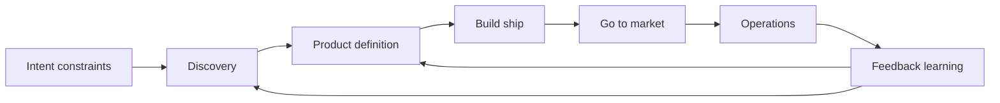
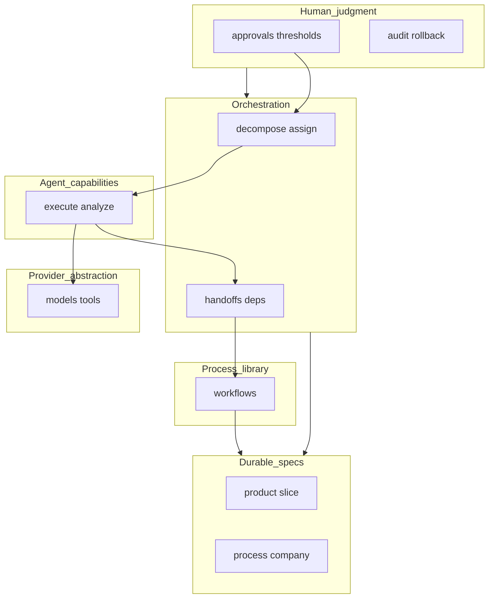

# AI-native operating framework

**Version:** 0.1 (initial)  
**Normative prose.** Machine-validated rules and instances take precedence when they exist; see §5.

---

## 0. Document control

### 0.1 Audience

- **Agents:** Primary executors of this framework—configuration, retrieval, and actions **MUST** align with normative sections below and with validated artifacts where present.
- **Human operators:** Governance, approvals, strategy, and override—**MUST** retain authority defined in §3 and §10.

### 0.2 Authority ladder

1. JSON Schema under `spec/schema/`  
2. Validated YAML/JSON under `spec/examples/` and (when introduced) `spec/processes/`  
3. `spec/policy/event-taxonomy.yaml`  
4. `agents/interfaces.yaml`  
5. Versioned procedure playbooks under `ai/playbooks/*.md` where a repository maintains them — **MUST NOT** contradict 1–4  
6. This Markdown file and other `docs/*` (explanatory narrative; **MUST NOT** override 1–5)

Repository-local agent files: root `AGENTS.md` plus `ai/PLAYBOOKS.md`, `ai/SKILLS.md`, `ai/skills/`, `ai/MEMORY.md`, and related indices are routing and bootstrap surfaces unless promoted into machine-validated schema or policy. They **SHOULD** align with items 1–5 and **MUST NOT** contradict them (including normative procedure playbooks under `ai/playbooks/*.md`).

### 0.3 Conformance keywords

- **MUST / MUST NOT:** Hard requirement. Violation blocks release unless a human waiver is recorded in the decision log.  
- **SHOULD / SHOULD NOT:** Default; deviation **MUST** be justified in the decision log.  
- **MAY:** Optional.

---

## 1. Identity and scope

### 1.1 What this framework is

An **AI-native operating system** for building and running **product-led companies**: spec-driven, event-observable, human-governed, **provider-agnostic** at the core.

### 1.2 What this framework is not

- A single vendor product or model.  
- A claim of full autonomy.  
- Unstructured chat as the system of record.  
- A substitute for legal, financial, or security review where applicable.

### 1.3 Definitions

- **Internal positioning:** System for turning stated intent into a functioning company.  
- **External positioning — variant A:** Company-building OS: agent-operated execution, human-guided strategy.  
- **External positioning — variant B:** Coordinated agents operating product-led companies under explicit human governance.

---

## 2. Core principles

| Principle | Normative requirement |
|-----------|----------------------|
| **AI-first** | AI **MUST** be a first-class subsystem: capabilities, evals, failure handling—not an ad-hoc add-on. |
| **API-first & modular** | Boundaries **MUST** be composable, replaceable, observable (interfaces, events, health). |
| **Leverage** | Small teams **SHOULD** achieve large output via agents; risk **MUST NOT** be concealed. |
| **Event-driven** | Material state changes **MUST** emit **structured events** for analytics, automation, audit. |
| **Persistent context** | Decisions and learnings **MUST** live in structured, versioned artifacts—not only transient chat. |
| **Provider-agnostic** | Business logic **MUST NOT** depend on one LLM vendor, agent IDE, or orchestration engine. |
| **Reliability over novelty** | Prefer proven patterns where failure cost is high (money, data, access, reputation). |
| **Auditability** | Significant automation **SHOULD** be traceable (`correlation_id`, workflow run id, decision id). |

---

## 3. Division of labor

### 3.1 Default allocation

| Role | Responsibility |
|------|----------------|
| **Agent capabilities** | Execution, coordination, iteration, analysis within declared constraints. |
| **Human operators** | Strategy, taste, ambiguity resolution, approval of irreversible or high-stakes outcomes. |

**Rule:** *Agents propose and execute; human operators decide under uncertainty.*

### 3.2 Leverage target (non-normative ratio)

A **~90% automated execution / ~10% human judgment** split is an **aspirational leverage target**, not proof of autonomy. Actual ratios **MUST** be governed by machine-readable **judgment policy** (§10): checkpoints, confidence thresholds, escalation.

### 3.3 Mandatory human involvement

Agents **MUST** escalate or halt when **any** holds:

- Ambiguity cannot be resolved from spec or policy.  
- Stakes are high (legal, financial, reputation, security, broad credential use).  
- Confidence is below the step’s threshold.  
- Strategy or positioning must change.  
- Required approval is missing.

In a personal repository operated by a single human, the framework **MAY** define that repository owner as the terminal human checkpoint for specific medium-risk actions once the evidence bundle is complete. This is still human-governed; it is not equivalent to removing the checkpoint.

---

## 4. End-to-end value chain

The framework covers the full path from intent to operating company:

| Stage | Purpose | Primary artifacts |
|-------|---------|-------------------|
| **Intent** | Goals, constraints, risk appetite | Company/process spec (when present); decision log |
| **Discovery** | Opportunities, ICP, positioning | Research outputs; updated spec; events |
| **Product** | MVP scope, requirements, model | Product/slice spec; data model; event catalog |
| **Build & ship** | Vertical delivery | Code, infra, tests, telemetry |
| **Go-to-market** | Launch, demand, narrative | Assets, campaigns, metrics definitions |
| **Operations** | Support, billing, internal ops | Playbooks, events, dashboards |
| **Feedback** | Learning loop | Metrics, qualitative signals, spec updates |

---

## 5. System architecture (six layers)

### 5.1 Layer stack

1. **Provider abstraction** — Model routing, tool adapters, secrets boundaries; vendors **MAY** be swapped without rewriting orchestration semantics.  
2. **Agent capability layer** — Units with goals, tool allowlists, context policy, constraints, escalation. **Capabilities, not mascots:** no vendor names in business rules.  
3. **Orchestration layer** — Decomposition, assignment, handoffs, dependencies, durable workflow state. **Not** equivalent to a single free-form model thread.  
4. **Process library** — Versioned workflows (§11); primary encoded operating knowledge.  
5. **Human judgment layer** — Approvals, thresholds, audit, rollback (§10).  
6. **Feedback & learning** — Signal ingestion; proposed spec/process updates; **MUST NOT** silently overwrite human-approved truth without policy.

### 5.2 Reference diagram

---

## 6. Tooling reference (default stack)

Bindings below are **recommended defaults** for greenfield implementations; the framework **MUST** remain valid if individual components are substituted behind the abstraction layer.

| Concern | Default choice | Role |
|---------|----------------|------|
| **Source control / PR governance** | GitHub + branch protection + configurable AI code review (or equivalent) | Reviews, approvals, merge policy, audit trail |
| **Frontend** | Next.js + Tailwind + shadcn/ui | Product UI, marketing surfaces |
| **Application API** | Next.js route handlers or Node / FastAPI | Business logic, auth integration |
| **Data** | PostgreSQL; Supabase for auth/storage/APIs | System of record |
| **AI execution** | Multiple LLM APIs + coding agents as tools | Generation, analysis, implementation |
| **Orchestration (maturity 3+)** | LangGraph or equivalent | Stateful workflows behind §5.1 layer 3 |
| **Product analytics** | PostHog (or equivalent) | Funnels, experiments, feature usage |
| **Errors** | Sentry (or equivalent) | Exceptions, regressions |
| **Hosting** | Vercel + managed DB / Supabase | Deploy and scale |
| **Validation CI** | Node + AJV + YAML parser | Schema validation on `spec/examples/*` |

### 6.1 Repository tooling (reference layout)

Typical layout for a framework-aligned repo:

| Path | Function |
|------|----------|
| `spec/schema/` | JSON Schema definitions |
| `spec/examples/` | Validated product/slice instances |
| `spec/policy/` | Event taxonomy and related policy YAML |
| `spec/processes/` | *(Introduce)* validated process/workflow instances |
| `templates/` | Generators and empty templates (e.g. slice spec) |
| `agents/interfaces.yaml` | Logical tool contracts |
| `AGENTS.md` | Repository-local bootstrap instructions at repo root; authority map and execution rules for agents |
| `ai/SKILLS.md` | Skill discovery index under `ai/`; maps recurring work to skills, playbooks, and artifacts |
| `ai/skills/` | On-demand skill bodies loaded only when selected from `ai/SKILLS.md` |
| `ai/MEMORY.md` | Durable working memory: current state, constraints, glossary, decisions, open loops |
| `scripts/validate-spec.mjs` | Local and CI validation |
| `.github/workflows/` | CI pipelines |
| `ai/PLAYBOOKS.md` | Playbook discovery index under `ai/`; links into `ai/playbooks/` |
| `ai/playbooks/` | On-demand procedure playbooks loaded from `ai/PLAYBOOKS.md` |

---

## 7. Roles in the AI layer

### 7.1 Executors

Task runners—LLM-backed or deterministic—**MUST** operate inside capability constraints.

### 7.2 Capability types (non-exhaustive catalog)

Strategist, Researcher, Product, Builder (engineering), Designer, Growth, Sales ops, Support, Finance/Ops. Each capability **MUST** eventually declare in machine form: tools, data access, escalation paths, forbidden actions.

### 7.2.1 Repository-local context bundle

Framework-aligned repositories **SHOULD** expose a lightweight agent context surface: **root `AGENTS.md`** as the common first-read entry point, plus an **`ai/` directory** for everything else agents load progressively:

- `AGENTS.md` — bootstrap contract for agents entering the repository (typically the only agent file at repo root).
- `ai/PLAYBOOKS.md` — low-cost playbook discovery index; points to unitary procedures under `ai/playbooks/`.
- `ai/playbooks/` — on-demand procedure playbooks for recurring governance and automation loops.
- `ai/SKILLS.md` — low-cost skill discovery index and routing surface for role- and task-oriented harnesses.
- `ai/skills/` — on-demand skill bodies for workflows that need more than index-level guidance.
- `ai/MEMORY.md` — durable repository memory with update rules.

This surface is the provider-agnostic replacement for hidden system prompts or IDE-only conventions. It gives agents a shared, versioned operating map while keeping the normative source of truth in schemas, policy, interfaces, and playbook files under `ai/playbooks/`.

Minimum requirements:

- `AGENTS.md` **MUST** define the repo authority ladder, canonical commands, change discipline, and escalation conditions (including where `ai/` lives).
- `ai/PLAYBOOKS.md` **SHOULD** list each versioned procedure playbook with triggers, inputs, outputs, and a link into `ai/playbooks/*.md`.
- `ai/SKILLS.md` **SHOULD** map recurring workflows to named skills or procedures, each with triggers, inputs, outputs, and links to deeper docs, `ai/playbooks/*.md`, or `ai/skills/*.md`.
- `ai/skills/` **SHOULD** hold the deeper skill bodies so agents load only the skill they selected instead of the whole catalog.
- `ai/MEMORY.md` **MUST** distinguish stable facts from temporary working state and **MUST NOT** become an unbounded log dump.
- Changes to these files **SHOULD** be reviewed whenever repo policy, architecture, workflows, or terminology changes.

### 7.3 Orchestrator

The **orchestrator** is **infrastructure** (workflow engine, graph runtime, queue worker graph, etc.), **not** a chat persona. It **MUST** implement: decomposition, state, retries, handoffs per `agents/interfaces.yaml` and future orchestration schemas.

---

## 8. Product development lifecycle

### 8.1 Phases

1. **Ideation** — Problem, user, goal, constraints, success metrics, risks. **Exit:** bounded scope; success metric defined.  
2. **Design** — Spec system (§9). **Exit:** schema-valid spec; event catalog stubbed; observability plan.  
3. **Implementation** — **Vertical slices** only: UI + API + persistence + AI surface (if any) + telemetry in one increment. **Exit:** deployed; observable; spec updated.  
4. **Feedback** — Measure; promote assumptions to facts or invalidate; re-enter ideation/design as needed.

### 8.2 Slice maturity labels

- **V1:** Fastest path; prove value.  
- **V2:** Production-ready, maintainable.  
- **V3:** Scalable / extensible where load or org complexity demands.

V3 patterns **MUST NOT** be introduced without decision-log rationale.

### 8.3 Cadence

**SHOULD** maintain: build → ship → measure → learn → iterate on a weekly rhythm.

### 8.4 Parallel maintenance (Cycle C)

Each shipped slice **SHOULD** land together with: updated validated spec(s), event catalog deltas when behavior is new, observability updates when measurement changes. Deferred spec work **MUST** be recovered in a **time-boxed extraction** immediately after if shipping precedes documentation.

---

## 9. Spec system (product and slice)

### 9.1 Required blocks (machine-validated)

| Block | Contents |
|-------|----------|
| **Ideation** | Problem, user, goal, constraints, metrics, risks |
| **Design** | Objective, requirements, system design, tooling decisions, assumptions, facts |
| **Data model** | Entities, fields, relationships, PII classification |
| **Events** | Catalog: name, semantics, versions, payload JSON Schema, PII, idempotency, ordering, emitters |
| **Observability** | Logging strategy, error tracking, core metrics |
| **Context recovery** | Canonical summary, key decisions, domain glossary |
| **Decision log** | Dated entries with alternatives |

Slice instances **MUST** include `slice_id` and `parent_product_id` per schema.

### 9.2 Event rules

- Names **MUST** conform to `spec/policy/event-taxonomy.yaml`.  
- Payloads **MUST** be JSON-serializable; breaking changes **MUST** version and deprecate.  
- Emissions **MUST** include envelope fields per policy (e.g. `occurred_at`, `emitted_by`, `correlation_id`, schema version).  
- Workflow and governance events (e.g. approval requested/granted/denied, step completed) **SHOULD** use the same taxonomy discipline.

---

## 10. Human judgment layer

Implementations **MUST** provide:

- **Checkpoints** bound to workflow steps.  
- **Confidence thresholds** per step class; sub-threshold behavior **MUST** escalate or fall back safely.  
- **Audit records**: approver identity, timestamp, evidence pointers.  
- **Rollback/compensation** where customer or financial impact exists.

Renaming a step **MUST NOT** bypass a checkpoint.

---

## 11. Process library

### 11.1 Normative role

The Process Library is the **encoded moat**: reusable, versioned procedures—treated with the same rigor as code (review, test, changelog).

### 11.2 Categories

| Category | Typical contents |
|----------|------------------|
| **Discovery** | Market research, opportunity mapping, ICP, positioning |
| **Product** | MVP scoping, PRD-style outputs, prioritization, QA flows |
| **Build** | Implementation loops, testing, release |
| **Go-to-market** | Launch, landing pages, content, outbound |
| **Operations** | Onboarding, support, reporting, pricing experiments, internal ops |

The repository-local `ai/PLAYBOOKS.md` and `ai/SKILLS.md` files are operator-facing indices into this library. Deeper procedure bodies may live under `ai/playbooks/` and `ai/skills/`, and process definitions may remain in Markdown initially, but each index **SHOULD** point to the canonical playbook file or schema-backed process artifact for each recurring workflow.

### 11.3 Workflow record shape (each entry SHOULD declare)

- **Inputs** and **outputs** (artifact types).  
- **Steps** and **dependencies**.  
- **Capabilities** invoked per step.  
- **Tools** and data sources.  
- **Events** emitted.  
- **Metrics** affected.  
- **Human checkpoints** and threshold references.

### 11.4 V1 default workflow set (B2B SaaS, small team)

For deployments targeting **solo founders or minimal teams** in **B2B SaaS**, the library **SHOULD** contain encoded workflows for the following baseline set (often adopted in dependency order when materializing a new repository; each entry is still an atomic playbook).

#### Repository foundation

- **Objective:** Make the repository safe for parallel human and agent execution before normal product work starts.
- **Inputs:** Repository owner, default branch, maintainer handle, and at least one validation command.
- **Outputs:** Protected default branch, CI baseline, merge policy, security defaults, and governance files.
- **Capabilities:** Builder, Product, Ops.
- **Checkpoints:** Human confirmation of repository owner, visibility, and merge policy before protection is enforced.
- **Playbook:** `ai/playbooks/repository-foundation.md`
- **Events (examples):** `ops.repo_published`, `ops.branch_protection_enabled`, `ops.security_automation_enabled`.

#### Pull request execution loop

- **Objective:** Automate PR review, testing, approval, and merge within explicit human-governed thresholds.
- **Inputs:** PR metadata, diff, branch protection rules, required checks, threshold policy, branch freshness state, and residual-risk decision.
- **Outputs:**
  - Initial risk classification.
  - Residual-risk decision.
  - Branch freshness decision.
  - Validation evidence.
  - Review outcome.
  - Approval decision.
  - Merge or escalation state.
  - When automation is authorized for the residual-risk tier and all merge gates are green, the executing agent **MUST** finish the loop—merge directly or verify the configured merge executor (for example a queue) merged—rather than stopping at an open PR.
- **Capabilities:** Builder, Ops, Researcher, AI reviewer backend.
- **Checkpoints:**
  - Human approval **MUST** be required for high-risk changes and **SHOULD** be required whenever confidence or evidence falls below policy thresholds.
  - Event-ordering failures between automation steps **MUST NOT** by themselves force human review.
  - Automation-owned PRs **MUST** be synced with the current protected branch before review authority is exercised.
  - Deterministic PR state such as residual-risk labels **MUST** be set automatically when policy can infer it.
  - Control-plane PRs **MUST** be judged by the policy currently merged on the protected branch until the update itself lands.
  - Repository-level auto-review configuration such as GitHub rulesets or app integrations **MAY** request an AI review automatically, but **MUST NOT** itself be treated as approval authority.
  - When a repository-configured reviewer exists, both its status context and its current-head review output **SHOULD** be consumed before the agent assigns residual risk; acceptable output is either a formal review on that SHA or a configured-reviewer timeline comment that explicitly references it.
  - Missing or pending reviewer evidence on the current head SHA **MUST** remain a blocking state rather than an implicit pass.
  - Agents **MUST NOT** merge while any configured merge gate is still pending, even if host branch protection is missing or misconfigured.
  - If reviewer follow-up is needed, an authorized collaborator **MAY** request it through host-supported mechanisms such as reviewer commands or the repository UI.
  - If that follow-up causes a bot or app to push a new PR commit, required checks and review freshness **MUST** be re-evaluated on the new head SHA.
  - Host-platform approval prompts on privileged downstream automation **MUST** be interpreted as trust-boundary safeguards unless the required PR-scoped checks themselves fail.
  - If a human checkpoint remains, automation **MUST** complete all non-human preparation work first and leave the PR approval-ready wherever the host platform allows it.
  - In personal-repository single-human mode, the owner **MAY** be the final checkpoint for allowed medium-risk changes, provided policy explicitly says so and the agent states the exact action required from the owner.
- **Playbook:** `ai/playbooks/pull-request-execution-loop.md`
- **Events (examples):** `pr.risk_classified`, `pr.residual_risk_set`, `pr.branch_outdated`, `pr.review_completed`, `pr.escalated`, `pr.merged`.

#### Agent context bundle

- **Objective:** Install and maintain the repository-local runtime standard that lets agents bootstrap correctly without relying on hidden prompt state.
- **Inputs:** Repository purpose, authority ladder, canonical commands, playbooks, glossary, and current operating constraints.
- **Outputs:** Versioned root `AGENTS.md`, plus `ai/SKILLS.md`, optional `ai/skills/`, `ai/PLAYBOOKS.md`, `ai/playbooks/`, and `ai/MEMORY.md` linked to the framework.
- **Capabilities:** Builder, Product, Ops.
- **Checkpoints:** Human review when the bundle changes agent authority, escalation rules, or durable memory policy.
- **Playbook:** `ai/playbooks/agent-context-bundle.md`
- **Events (examples):** `agent.context_bundle_installed`, `agent.skill_registered`, `agent.memory_updated`.

After pull request execution is in place, the library **SHOULD** contain encoded workflows for the following six operating processes.

#### W1 — Opportunity research

- **Objective:** Rank plausible opportunities from a defined idea or market space.  
- **Inputs:** Constraints, budget signals, time horizon, any prior hypotheses.  
- **Outputs:** Ranked opportunity list, kill/keep rationale, assumptions to validate.  
- **Capabilities:** Researcher, Strategist.  
- **Checkpoints:** Human confirmation before committing to a single opportunity thread.  
- **Events (examples):** `discovery.opportunity_ranked`, `discovery.research_completed`.

#### W2 — ICP and positioning

- **Objective:** Define ideal customer profile and market positioning.  
- **Inputs:** Chosen opportunity, competitive landscape notes.  
- **Outputs:** ICP document, positioning statement, anti-ICP.  
- **Capabilities:** Strategist, Product.  
- **Checkpoints:** Human approval of positioning before external launch materials.  
- **Events (examples):** `positioning.icp_defined`, `positioning.statement_finalized`.

#### W3 — MVP scoping

- **Objective:** Minimal lovable scope for first validated learning.  
- **Inputs:** ICP, positioning, technical constraints.  
- **Outputs:** MVP spec linked to product/slice schema, success metrics, out-of-scope list.  
- **Capabilities:** Product, Builder.  
- **Checkpoints:** Human sign-off on scope and metrics.  
- **Events (examples):** `product.mvp_scoped`, `product.requirement_added`.

#### W4 — Launch asset creation

- **Objective:** Produce launch-ready assets (site copy, decks, emails, etc., per plan).  
- **Inputs:** MVP spec, brand constraints.  
- **Outputs:** Asset bundle, distribution checklist.  
- **Capabilities:** Designer, Growth, Builder.  
- **Checkpoints:** Human review of public-facing claims and compliance-sensitive copy.  
- **Events (examples):** `gtm.asset_published`, `gtm.launch_checklist_completed`.

#### W5 — Growth experimentation

- **Objective:** Run structured experiments on acquisition and activation.  
- **Inputs:** Baseline metrics, hypotheses, channel constraints.  
- **Outputs:** Experiment designs, results, recommendations.  
- **Capabilities:** Growth, Researcher.  
- **Checkpoints:** Human approval for spend and brand-risk experiments.  
- **Events (examples):** `growth.experiment_started`, `growth.experiment_completed`.

#### W6 — Customer feedback synthesis

- **Objective:** Consolidate qualitative and quantitative feedback into actionable spec changes.  
- **Inputs:** Support data, interviews, usage analytics.  
- **Outputs:** Prioritized insight list, proposed spec deltas, assumption updates.  
- **Capabilities:** Support (analytics), Product.  
- **Checkpoints:** Human triage for roadmap commitment.  
- **Events (examples):** `feedback.synthesis_completed`, `product.roadmap_proposed`.

*Schemas for process instances **MAY** trail the product spec schema; when introduced, they **MUST** follow the same validation discipline.*

---

## 12. Operating loop (runtime procedure)

For each significant initiative:

1. Instantiate or select goal from spec.  
2. Decompose into tasks with explicit dependencies.  
3. Bind **Process Library** templates and **capabilities**.  
4. Execute; emit events and metrics.  
5. Collect evidence (artifacts, URLs, eval results).  
6. Run automated checks; route to human judgment per §10.  
7. Merge learnings into specs (assumptions ↔ facts).

---

## 13. Quality gates

Before closing a slice or workflow tranche, agents **MUST**:

- Preserve or strengthen validation (schema, automated tests where applicable).  
- Ensure new external behavior is **observable** per spec.  
- For AI-mediated user impact, maintain an **eval** artifact appropriate to risk (goldens, regressions, or defined human spot-check protocol).

---

## 14. Governance and ethics

- **MUST NOT** represent the system as fully autonomous in marketing or internal policy.  
- **MUST** preserve **human override** for governed actions.  
- **MUST** keep secrets out of specs; reference secret **names** only.  
- High-impact changes **SHOULD** follow **agent-propose → human-approve** with decision-log entry.

---

## 15. Automation maturity phases

1. Manual work with AI assistance.  
2. Scripts, templates, coding agents on bounded tasks.  
3. Stateful multi-step orchestration with measurement.  
4. Broad ops automation (product, growth, ops) **under** judgment policy.

Advancing phases **REQUIRES** stronger policy and measurement—not only more automation.

---

## 16. North-star outputs

From inputs (market or idea space, constraints, goals), a mature implementation **SHOULD** reliably produce:

- Ranked opportunities with explicit assumptions.  
- Recommended product shape and MVP plan.  
- Launch strategy and scoped assets.  
- Execution roadmap.  
- Ongoing prioritized recommendations tied to feedback loops.

Output quality depends on **spec fidelity, data, evals, and governance**—not on any single model provider.

---

## 17. Anti-patterns (MUST avoid)

- Spec prose without validated artifacts.  
- Ungoverned event proliferation.  
- Renaming agents without changing capabilities or tools.  
- Irreversible external effects without checkpoint records.  
- Embedding vendor-specific assumptions in core business rules.

---

## 18. Closing principle

The framework’s value is the **encoding** of how companies are built, operated, and improved into a **reusable, learning, auditable system**—with agents executing structured work under **machine-verifiable** rules and **human judgment** where it belongs.

---

*End of framework v0.1.*
